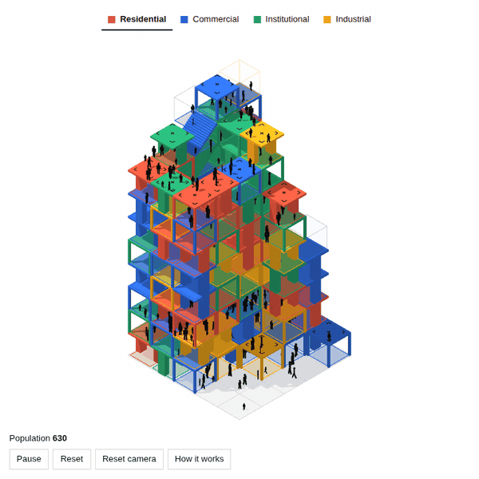

# Occupied

*Occupied* is a game where architecture is made by a crowd rather than drawn. You choose one of four programs (residential, commercial, institutional or industrial) and click a cell on a 5 × 5 grid, or later on a roof or the open shaft above a stair. People of four ages, shown by their size, walk to the programs they are drawn to, and their use gradually fills the cell's cube. Once the cube is full it becomes a stair, wall, platform or bridge; the rules choose which, not you. Each completed program adds 5 people to the starting 50, so the crowd grows as you build. The result is a colored tower that records where each program was placed and how people moved, growing storey by storey.

## Play

Open `index.html` in a browser. There is nothing to install or build. The page loads Three.js (r128) from cdnjs and the Archivo typeface from Google Fonts, so it needs an internet connection.

- Pick a program at the top, then click a cell.
- Marked roofs, and the shaft above a stair, take the next program.
- Drag to turn the model, scroll or pinch to zoom.

## How it works

| Who | Controls |
| --- | --- |
| You | where program is introduced |
| Agents | where activity develops |
| The simulation | when architecture appears |
| Randomised rules | what form it takes |

A few rules are settled before chance, so the tower can keep climbing: the cells at the foot and head of a stair always become a platform or bridge, a storey with no way up gets its stair first, and no form may cut off or split a floor people can reach.

## Tuning

Everything adjustable is in the `PARAMS` block at the top of the script in `index.html`: grid size, starting population, newcomers per program, age groups and their attraction to each program, hotspot thresholds, form odds, and program colors.

## Status

A prototype. Reaching 10 storeys is possible but not guaranteed; some games stall around 6 to 7. The GIF above was recorded from an automated playthrough.
